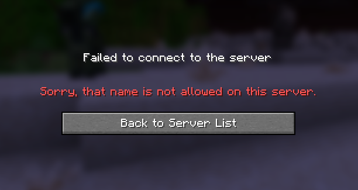
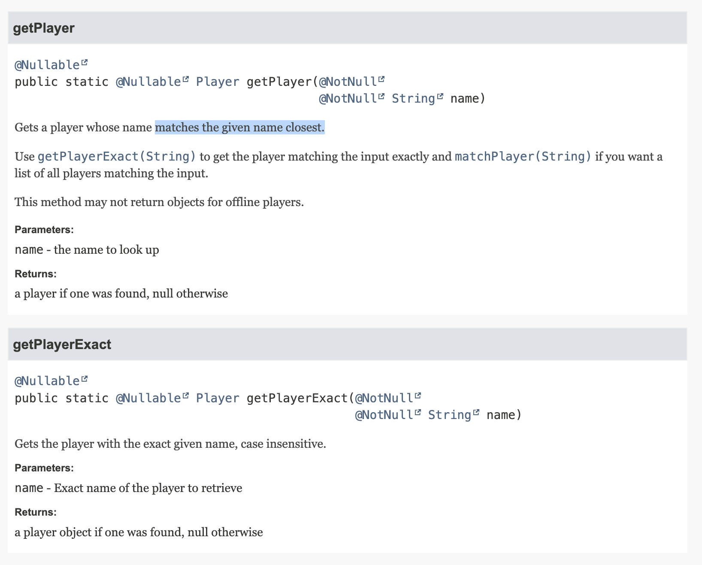
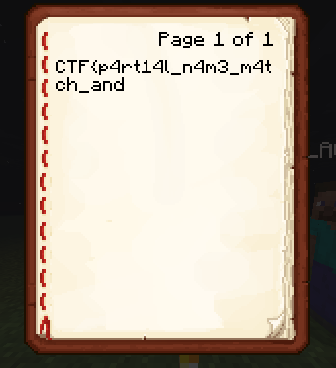
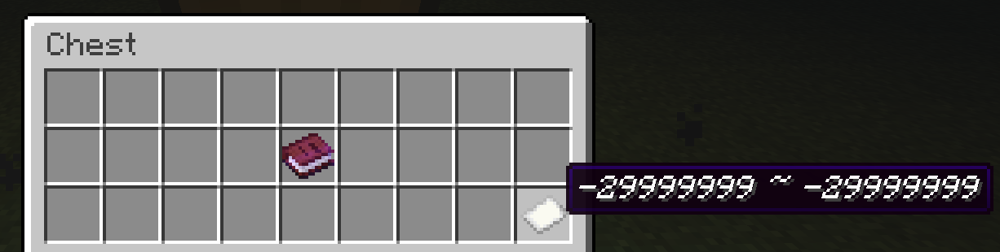
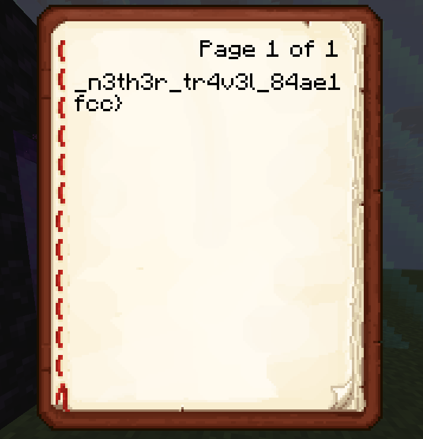
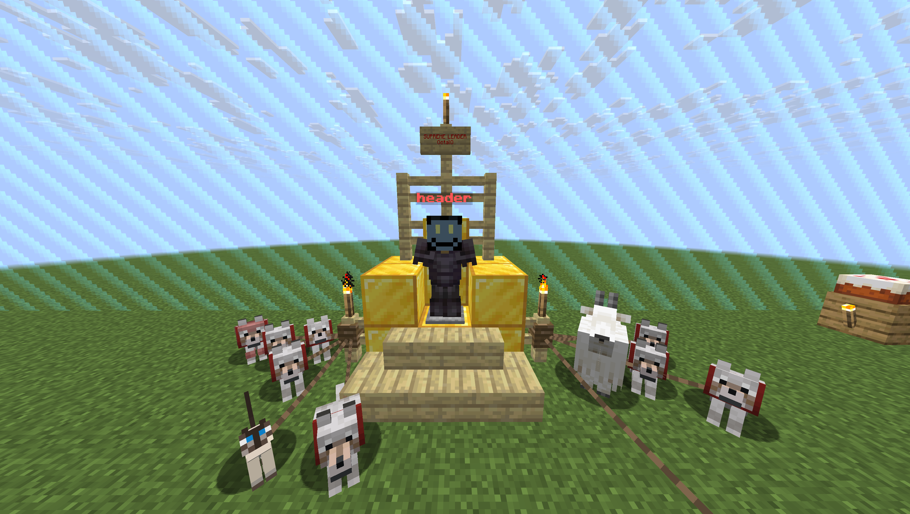

# teleporter - ROCSC 2026 Finals

Exploitable Minecraft server plugin that allows players to teleport to each other

# Introduction

Teleporter is a CTF challenge that I created for the final phase of the Romanian Cyber Security Challenge 2026 (ROCSC).
It involved exploiting bugs in a teleportation feature provided by a Minecraft Java Edition server plugin.

# Overview

We are given a JAR file containing what seems to be a Minecraft PaperMC server plugin, as well
as a server instance to connect to, version being Java 1.21.11.

We can log onto the server without an actual Minecraft account, since online mode is set to false. The first thing we can see on the server is that we have **creative mode** and that there's
a player named **"FLAG_PART1"** logged on.


# Inspecting the plugin

In order to understand what's going on, we need to decompile the given plugin.
We can use jadx for that:
```
$ jadx teleporter-1.0.0.jar 
INFO  - loading ...
INFO  - processing ...
INFO  - done
```

Looking into sources/com/rocsc/teleporter, we can see 3 files:
- MainPlugin.java
- MainListener.java
- TeleportToPlayerCommand.java

## MainPlugin.java

This just sets things up, registers listeners, loads commands and so on.
The important thing here is that the command `/tpto` exists.

## MainListener.java

This code makes sure that no one, except the internal bot, logs onto the server as the player "FLAG_PART1".
Since online mode is disabled, anyone could normally do that by changing their username.

```java
public class MainListener implements Listener {
    private static final String BLOCKED_NAME = "FLAG_PART1";
    private static final String LOOPBACK_IP = "127.0.0.1";

    @EventHandler
    public void onPreLogin(AsyncPlayerPreLoginEvent event) {
        if (event.getName().equalsIgnoreCase(BLOCKED_NAME)) {
            String ip = event.getAddress().getHostAddress();

            if (!LOOPBACK_IP.equals(ip)) {
                event.disallow(
                        AsyncPlayerPreLoginEvent.Result.KICK_OTHER,
                        "§cSorry, that name is not allowed on this server."
                );
            }
        }
    }
    
    @EventHandler
    public void onPlayerJoin(PlayerJoinEvent event) {
        event.getPlayer().sendMessage("Welcome to the server!");
    }
}
```

Attempting to log on as FLAG_PART1 results in:<br>


## TeleportToPlayerCommand.java

This is the source code of the `/tpto` command:
```java
public boolean onCommand(CommandSender sender, Command command,
                                    String label, String[] args) {
    if (!(sender instanceof Player)) {
        sender.sendMessage("§cOnly in-game players can use this command.");
        return true;
    }

    if (args.length != 1) {
        sender.sendMessage("§eUsage: /" + label + " <player>");
        return true;
    }

    boolean online = Bukkit.getOnlinePlayers().stream().map((v0) -> {
        return v0.getName();
    }).anyMatch(name -> {
        return name.equalsIgnoreCase(args[0]);
    });

    if (!online) {
        sender.sendMessage("§cPlayer '" +
                args[0] + "' is not online.");
        return true;
    }

    if (args[0].equalsIgnoreCase("FLAG_PART1")) {
        sender.sendMessage("§cNot allowed.");
        return true;
    }

    sender.sendMessage("§eAttempting to teleport...§e...");

    World world = Bukkit.getPlayer(args[0]).getWorld();

    Bukkit.getScheduler().runTaskLater(this.plugin, () -> {
        Player player = (Player) sender;
        Player target = Bukkit.getPlayer(args[0]);

        if (target == null || !target.isOnline()) {
            player.sendMessage("§cPlayer '" + args[0] +
                                    "' is not online.");
        } else if (player.equals(target)) {
            player.sendMessage("§eYou are already at your own location!");
        } else {
            player.teleport(new Location(world,
                    target.getLocation().getX(),
                    target.getLocation().getY(),
                    target.getLocation().getZ(),
                    target.getLocation().getYaw(),
                    target.getLocation().getPitch()
                )
            );
            player.sendMessage("§aTeleported to §f" + 
                            target.getName() + "§a.");
        }
    }, 100L);

    return true;
}
```

We can see that it allows us to teleport to any player, except "FLAG_PART1".
It is worth noting that the teleportation happens 5 seconds after running the command (one second is 20 ticks in Minecraft, 20L * 5 = 100L).

# Part 1

From all that we have analyzed, it's obvious that we need to get to the player "FLAG_PART1".

We can't join the server as them, and we cannot directly use the `/tpto` command to teleport
to them.

When taking a closer look, we notice that the Bukkit method `getPlayer` is used.

[Documentation for getPlayer](https://jd.papermc.io/paper/1.21.11/org/bukkit/Bukkit.html#getPlayer(java.lang.String))



The documentation reveals that this method doesn't get the player by the exact username, instead the method `getPlayerExact` does that. 

`getPlayer` gets the player with the closest matching name to the given parameter.

Combining this idea with the fact that the teleportation is done 5 seconds after running the command allows us to do the following:
1. Log onto the server with **User A**, name doesn't matter
2. Log onto the server with **User B**, name: "FLAG" or anything similar to "FLAG_PART1", but not the same
3. From **User A**, run `/tpto <User B>`
4. Within 5 seconds, disconnect **User B** from the server

This way, we pass the first check, the one that requires the target player to be online when
running `/tpto`, and after the 5 seconds pass, `getPlayer` will be used to locate the target's coordinates, but since the player "FLAG" is no longer online, it will find the closest match, which is... "FLAG_PART1"! So we will be teleported to them.

There we find a chest containing a book with the first part of the flag and a paper with
some coordinates: `-29999999 ~ -29999999`. That's at one corner of the Minecraft world border.




# Part 2

What we have left is to see what's at those coordinates. Obviously, it would take a horrendous amount of time to go to those coordinates without teleporting, even using hacks.

We need to find a way to abuse any bugs left in the plugin in order to get there fast.

The task description says "We Need to Go Deeper" (Minecraft achievement that you get when entering the Nether).
This hints at somehow using the Nether dimension to do this.

One very known fact specific to Minecraft is that if we travel N blocks in the Nether and use
a portal to get back to the Overworld, we will have traveled 8 * N blocks there.

Still too slow, until we take a look at the plugin's source code again and notice:
```java
// Lots of code removed to highlight the flaw (replaced with "...")
World world = Bukkit.getPlayer(args[0]).getWorld();

Bukkit.getScheduler().runTaskLater(this.plugin, () -> {
    ...
    ...
    ...

    } else {
        player.teleport(new Location(world, ...);
        ...
    }
}, 100L);
```

While the coordinates of the target are obtained right before teleporting (after those 5 seconds), the world is determined at runtime (5 seconds before the teleportation).

We can abuse this by doing the following:
1. Once again, log 2 players onto the server, **User A** and **User B**, names don't matter
2. From **User B**, go into the Nether by making a Nether portal
3. From **User B**, travel a decent amount of blocks in the -x -z direction (for example, go to -500 -500), you can get there fast by flying over the Nether roof
4. From **User B**, build a portal where you are, don't go in yet
5. From **User A**, use `/tpto` to teleport to **User B**
6. From **User B**, within those 5 seconds, walk into the portal to the Overworld
7. Repeat steps 4-6, continuously switching places between **User A** and **User B** (**1st repetition:** step 4 will be done from **User A**, step 5 from **User B**, step 6 from **User A**. **2nd repetition:** 4 - **B**, 5 - **A**, 6 - **B** and so on). Do that until one of the users has reached the target coordinates.

## Explanation

At first, when **User A** teleports to **User B**, the world will be set to the Nether. Within those 5 seconds, **User B** will walk through the portal and end up in the Overworld where each coordinate will be 8 times the coordinate where they were in the Nether.
After the 5 seconds, **User A** will be teleported **in the Nether**, at those coordinates, 8
times higher than what they were supposed to be.

Example:
- **User B** is at 1000 ~ 1000 in the Nether
- **User A** runs `/tpto <User B>`, world is set to Nether
- **User B** goes into the Overworld, ends up at -4000 ~ -4000 
- **User A** teleports to 8000 ~ 8000 in the Nether, 5 seconds later (64000 ~ 64000 in the Overworld)

After doing this, we can repeat the process, except **User B** will now be teleporting
to **User A** and **User A** will be the one walking into the Overworld.

Obviously, further iterations will require us to switch between each user's role.

When one of the users has reached the Nether coordinates corresponding to the target coordinates in the Overworld, they can just walk through a portal again and end up at the
second part of the flag.

We don't have to worry about unintentionally going further than the target coordinates, since they're at the world border and when walking through the portal, we will either way be sent there.

## Goal reached

As we get there, we find another chest containing a book with the second part of the flag.



# Flag

```CTF{p4rt14l_n4m3_m4tch_and_n3th3r_tr4v3l_84ae1fcc}```

# Thoughts

This was a very fun challenge to make.
Initially, I only had part 2 in mind, inspired from [BedTP](https://2b2t.miraheze.org/wiki/Travel#Bed_Travel), a historical exploit used especially on the server 2b2t, which also involved an exponentially fast travelling method using the Nether.
However, as I was writing the plugin with the `getPlayer` method, unaware of its issue, I took a quick look at the
documentation and noticed the existence of the `getPlayerExact` method, which made me realize that I could make this
challenge even better using this property of `getPlayer`.
Hope you all enjoyed it!



# Video walkthrough

[Walkthrough](walkthrough.mp4)


